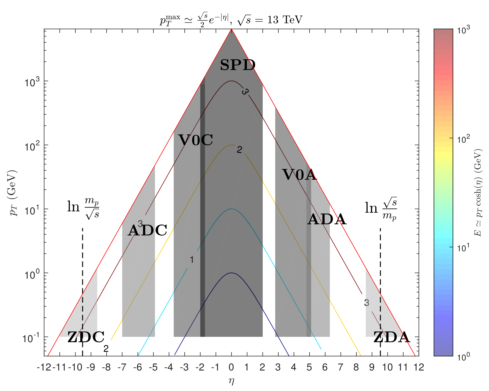

# Diffractive-Combinatorics-GRID
ALICE grid processing code for https://github.com/mieskolainen/Diffractive-Combinatorics

Used with ALICE software: https://alice-doc.github.io/alice-analysis-tutorial/building/

mikael.mieskolainen@cern.ch, 2019
